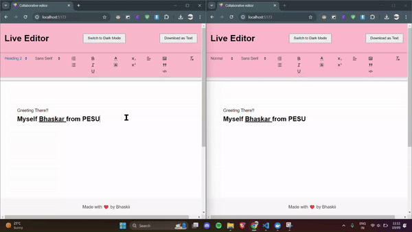

# Live Editor with React, Quill, Socket.IO, and MongoDB Atlas

This project is a collaborative text editor built using React, Quill, and Socket.IO. It allows multiple users to simultaneously edit a document in real-time, with changes instantly reflected across all connected clients. The frontend is developed using Vite with React, providing a fast and efficient development environment, and is deployed on **Vercel**. The backend is deployed on **Render**, with MongoDB Atlas providing the database.

## Demo

#### Spinning up containers

.gif)

#### Working Demo




## Table of Contents

- [Live Editor with React, Quill, Socket.IO, and MongoDB Atlas](#live-editor-with-react-quill-socketio-and-mongodb-atlas)
  - [Demo](#demo)
      - [Spinning up containers](#spinning-up-containers)
      - [Working Demo](#working-demo)
      - [Cleanup](#cleanup)
  - [Features](#features)
  - [Getting Started](#getting-started)
    - [Prerequisites](#prerequisites)
    - [Usage Guidelines](#usage-guidelines)
  - [Contributing](#contributing)
    - [Prerequisites](#prerequisites-1)
    - [Environment Variables](#environment-variables)
    - [Running development server](#running-development-server)

## Features
- **Real-time Collaboration**: Multiple users can collaborate and edit the same document in real-time.
- **Rich Text Editing**: The Quill editor allows for easy and intuitive rich text editing.
- **Efficient Development**: The frontend is built with Vite and React, providing a fast and efficient development environment.
- **Socket.IO Integration**: Socket.IO is used for handling real-time communication between clients.
- **MongoDB Atlas**: Cloud-based MongoDB storage for documents.
- **Dockerized for Easy Deployment**: Both frontend and backend are containerized for seamless local development.

## Getting Started

### Prerequisites

Make sure you have the following installed:

- Docker: [Download and install Docker](https://docs.docker.com/get-docker/)
- Docker Compose: [Download and install Docker Compose](https://docs.docker.com/compose/install/)
- MongoDB Atlas account (you’ll need to set up your cluster, as described below).

### Usage Guidelines

1. Clone the repository:

   ```bash
   git clone https://github.com/yourusername/live-editor.git
   ```

2. Create a `.env` file in the root directory and add the following environment variables (replace MongoDB credentials with your actual details):

    ```bash
    # Local development ports
    PROJ_SERVER_PORT=8001
    PROJ_CLIENT_PORT=5173

    # MongoDB Atlas connection string
    PROJ_DB_CONNECTION_STRING=mongodb+srv://<username>:<password>@cluster0.mongodb.net/editor-db?retryWrites=true&w=majority

    # Local URLs for Docker setup
    PROJ_DEPLOYED_SERVER_URL=http://localhost:${PROJ_SERVER_PORT}
    PROJ_DEPLOYED_FRONTEND_URL=http://localhost:${PROJ_CLIENT_PORT}
    ```

3. To start the containers, ensure you are at the project's root directory and execute the following command:
    ```bash
    docker-compose build
    docker-compose up
    ```
    You can append the `-d` flag to run the containers in detached mode:
    ```bash
    docker-compose up -d
    ```

4. Once the containers are up, follow the links displayed in the terminal to access the frontend (`http://localhost:5173`) and backend.

5. To halt the containers, terminate the process in the terminal using `Ctrl+C`. To remove the containers, ensure you are at the project's root directory and execute the following command:
    ```bash
    docker-compose down
    ```

6. To clear all Docker images and rebuild them (if there are code changes), use the following commands:
    ```bash
    docker image rm live-editor-client
    docker image rm live-editor-server
    ```

---

## Contributing

We welcome contributions to enhance and improve this project! Follow the steps below to get started:

### Prerequisites

Make sure you have the following installed:

- [Node.js](https://nodejs.org/)
- [pnpm](https://pnpm.io/)

### Environment Variables

Create a `.env` file in the root directory and add the following variables:

```bash
PROJ_SERVER_PORT=8001
PROJ_CLIENT_PORT=5173
PROJ_DEPLOYED_SERVER_URL=http://localhost:${PROJ_SERVER_PORT}
PROJ_DB_CONNECTION_STRING=mongodb+srv://<username>:<password>@cluster0.mongodb.net/editor-db?retryWrites=true&w=majority
PROJ_DEPLOYED_FRONTEND_URL=http://localhost:${PROJ_CLIENT_PORT}
```

### Running development server
1. Start MongoDB container:
   ```bash
   docker run -d -p 27017:27017 -v ~/mongodb:/data/db --name live-editor mongo:7.0.3
   ```
2. Switch to client/server folder. To install packages:
    ```bash
    pnpm install
    ```
3. To run server/client:
    ```bash
    pnpm run dev
    ```

